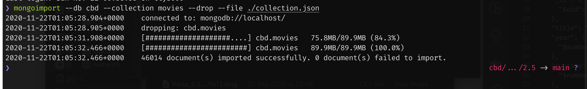

# MongoDB

Open-source document database, NoSQL. It is written in C ++, is cross-platform, has high performance, availability and is easily scalable. It works on the concept of collection and document.

## Database

It is the physical container for the collections. Each database has its files in the system. A MongoDB server typically has several databases.

## Collection

It is a group of MongoDB documents. It is equivalent to an RDBMS table. The collection exists within a database. Documents within a collection can have different properties, and documents within a collection typically have similar purposes.

## Document

A document is a set of values with their respective key and value. Documents have a dynamic layout, that is, in the same document it is not necessary to have the same type of properties or structures.

**Exemplo:**

```bash
{
   _id: ObjectId(7df78ad8902c)
   title: 'MongoDB Overview', 
   description: 'MongoDB is no sql database',
   by: 'tutorials point',
   url: 'http://www.tutorialspoint.com',
   tags: ['mongodb', 'database', 'NoSQL'],
   likes: 100, 
   comments: [	
      {
         user:'user1',
         message: 'My first comment',
         dateCreated: new Date(2011,1,20,2,15),
         like: 0 
      },
      {
         user:'user2',
         message: 'My second comments',
         dateCreated: new Date(2011,1,25,7,45),
         like: 5
      }
   ]
}
```

- **_id** - is a 12-byte hexadecimal number that ensures that each document is unique. We can provide **_id** when inserting a document or let the system create it automatically. Within these 12 bytes, the first 4 are the **timestamp**, the next 3 are the **machine id**, the next 2 are the **process id** of the MongoDB server and the last 3 are an **incremental** value.

## RDBMS vs MongoDB


### Advantages over RDBMS

- **No schema** - a collection can have different documents with different properties and the like.
- **Easy to scale**
- **Use ram to store the working set**
- etc.

## Data Model Design

MongoDB offers two types of data model:

- Embedded data model
- Normalized data model

**Embedded Data Model**

In this model we can have all related data in one document.

Example: An employee's information could be in three documents: Personal_details, Contact and Address but using the **embedded data model**, it would look like this:

```bash
{
	_id: ,
	Emp_ID: "10025AE336"
	Personal_details:{
		First_Name: "Radhika",
		Last_Name: "Sharma",
		Date_Of_Birth: "1995-09-26"
	},
	Contact: {
		e-mail: "radhika_sharma.123@gmail.com",
		phone: "9848022338"
	},
	Address: {
		city: "Hyderabad",
		Area: "Madapur",
		State: "Telangana"
	}
}
```

**Normalized Data Model**

The reverse model of the previous one. We use multiple documents and refer in the sub-documents to the original document:

**Employee:**

```
{
	_id: <ObjectId101>,
	Emp_ID: "10025AE336"
}
```

**Personal_details:**

```
{
	_id: <ObjectId102>,
	empDocID: " ObjectId101",
	First_Name: "Radhika",
	Last_Name: "Sharma",
	Date_Of_Birth: "1995-09-26"
}
```

**Contact:**

```
{
	_id: <ObjectId103>,
	empDocID: " ObjectId101",
	e-mail: "radhika_sharma.123@gmail.com",
	phone: "9848022338"
}
```

**Address:**

```
{
	_id: <ObjectId104>,
	empDocID: " ObjectId101",
	city: "Hyderabad",
	Area: "Madapur",
	State: "Telangana"
}
```

## Commands

### Use Command

It is used to create a database or use an existing one:

```bash
> use test_db
switched to db test_db
```

**See current database**

```bash
> db
test_db
```

**List all databases**

```bash
> show dbs
admin   0.000GB
config  0.000GB
local   0.000GB
```

As I just created the db, it is not present in the list. I'll add a document:

```bash
> db.movie.insert({"name":"tutorials point"})
WriteResult({ "nInserted" : 1 })

> show dbs
admin    0.000GB
config   0.000GB
local    0.000GB
test_db  0.000GB
```

### Drop Database

Used to delete an existing database:

```bash
> db.dropDatabase()
{ "dropped" : "test_db", "ok" : 1 }
> show dbs
admin   0.000GB
config  0.000GB
local   0.000GB
```

### Create Collection

Used to create a collection.

Basic syntax of **createCollection()** command is as follows −

```
db.createCollection(name, options)

```

In the command, **name** is name of collection to be created. **Options** is a document and is used to specify configuration of collection.

[Untitled](https://www.notion.so/5fd574de8ec84394bdd857a952fa2ed3)

Options parameter is optional, so you need to specify only the name of the collection. Following is the list of options you can use −

[Untitled](https://www.notion.so/88057cd0a34d429ab36ba8a2500a95eb)

**Exemplos:**

```bash
> use test
switched to db test
> db.createCollection("testColl")
{ "ok" : 1 }
> show collections
testColl
```

```bash
> db.createCollection("mycol", { capped : true, autoIndexID : true, size : 6142800, max : 10000 } )
{
	"ok" : 0,
	"errmsg" : "BSON field 'create.autoIndexID' is an unknown field.",
	"code" : 40415,
	"codeName" : "Location40415"
}
```

In MongoDB it is also possible to create collections automatically when inserting a document:

```bash
> db.tutorialspoint.insert({"name" : "tutorialspoint"})
WriteResult({ "nInserted" : 1 })
> show collections
testColl
tutorialspoint
```

### Drop Collection

Used to delete DB collections.

```bash
> show collections
testColl
tutorialspoint
> db.testColl.drop()
true
> show collections
tutorialspoint
```

## MongoDB Datatypes

- **String** − This is the most commonly used datatype to store the data. String in MongoDB must be UTF-8 valid.
- **Integer** − This type is used to store a numerical value. Integer can be 32 bit or 64 bit depending upon your server.
- **Boolean** − This type is used to store a boolean (true/ false) value.
- **Double** − This type is used to store floating point values.
- **Min/ Max keys** − This type is used to compare a value against the lowest and highest BSON elements.
- **Arrays** − This type is used to store arrays or list or multiple values into one key.
- **Timestamp** − ctimestamp. This can be handy for recording when a document has been modified or added.
- **Object** − This datatype is used for embedded documents.
- **Null** − This type is used to store a Null value.
- **Symbol** − This datatype is used identically to a string; however, it's generally reserved for languages that use a specific symbol type.
- **Date** − This datatype is used to store the current date or time in UNIX time format. You can specify your own date time by creating object of Date and passing day, month, year into it.
- **Object ID** − This datatype is used to store the document’s ID.
- **Binary data** − This datatype is used to store binary data.
- **Code** − This datatype is used to store JavaScript code into the document.
- **Regular expression** − This datatype is used to store regular expression.

### Insert

Allows you to insert data into a MongoDB collection. We can use the command **insert()** or **save()**

```bash
> db.test.insert({_id : ObjectId("507f191e810c19729de860ea"),
title: "MongoDB Overview",
description: "MongoDB is no sql database",
by: "tutorials point",
url: "http://www.tutorialspoint.com",
tags: ['mongodb', 'database', 'NoSQL'],
likes: 100})

WriteResult({ "nInserted" : 1 })
> show collections
test
tutorialspoint
```

In this case, it automatically created the test collection.

We can insert in **bulk** mode:

```bash
> db.post.insert([
...     {
...         title: "MongoDB Overview",
...         description: "MongoDB is no SQL database",
...         by: "tutorials point",
...         url: "http://www.tutorialspoint.com",
...         tags: ["mongodb", "database", "NoSQL"],
...         likes: 100
...     },
...     {
...     title: "NoSQL Database",
...     description: "NoSQL database doesn't have tables",
...     by: "tutorials point",
...     url: "http://www.tutorialspoint.com",
...     tags: ["mongodb", "database", "NoSQL"],
...     likes: 20,
...     comments: [
...         {
...             user:"user1",
...             message: "My first comment",
...             dateCreated: new Date(2013,11,10,2,35),
...             like: 0
...         }
...     ]
... }
... ])
BulkWriteResult({
	"writeErrors" : [ ],
	"writeConcernErrors" : [ ],
	"nInserted" : 2,
	"nUpserted" : 0,
	"nMatched" : 0,
	"nModified" : 0,
	"nRemoved" : 0,
	"upserted" : [ ]
})
```

### insertOne

Insert only one document into a collection

```bash
> db.empDetails.insertOne(
...     {
...         First_Name: "Radhika",
...         Last_Name: "Sharma",
...         Date_Of_Birth: "1995-09-26",
...         e_mail: "radhika_sharma.123@gmail.com",
...         phone: "9848022338"
...     })
{
	"acknowledged" : true,
	"insertedId" : ObjectId("5f980e3d30ab4091bfc7b88d")
}
```

## inserMany

Insert mutiple documents

```bash
> db.empDetails.insertMany(
...     [
...         {
...             First_Name: "Radhika",
...             Last_Name: "Sharma",
...             Date_Of_Birth: "1995-09-26",
...             e_mail: "radhika_sharma.123@gmail.com",
...             phone: "9000012345"
...         },
...         {
...             First_Name: "Rachel",
...             Last_Name: "Christopher",
...             Date_Of_Birth: "1990-02-16",
...             e_mail: "Rachel_Christopher.123@gmail.com",
...             phone: "9000054321"
...         },
...         {
...             First_Name: "Fathima",
...             Last_Name: "Sheik",
...             Date_Of_Birth: "1990-02-16",
...             e_mail: "Fathima_Sheik.123@gmail.com",
...             phone: "9000054321"
...         }
...     ]
... )
{
	"acknowledged" : true,
	"insertedIds" : [
		ObjectId("5f980e7d30ab4091bfc7b88e"),
		ObjectId("5f980e7d30ab4091bfc7b88f"),
		ObjectId("5f980e7d30ab4091bfc7b890")
	]
}
```

## Find

Allows you to query data from a MongoDB collection.

When find takes no argument, returns documents from the collection

```bash
> use sampleDB
switched to db sampleDB
> db.createCollection("mycol")
{ "ok" : 1 }
> db.mycol.insert([
...     {
...         title: "MongoDB Overview",
...         description: "MongoDB is no SQL database",
...         by: "tutorials point",
...         url: "http://www.tutorialspoint.com",
...         tags: ["mongodb", "database", "NoSQL"],
...         likes: 100
...     },
...     {
...         title: "NoSQL Database",
...         description: "NoSQL database doesn't have tables",
...         by: "tutorials point",
...         url: "http://www.tutorialspoint.com",
...         tags: ["mongodb", "database", "NoSQL"],
...         likes: 20,
...         comments: [
...             {
...                 user:"user1",
...                 message: "My first comment",
...                 dateCreated: new Date(2013,11,10,2,35),
...                 like: 0
...             }
...         ]
...     }
... ])
BulkWriteResult({
	"writeErrors" : [ ],
	"writeConcernErrors" : [ ],
	"nInserted" : 2,
	"nUpserted" : 0,
	"nMatched" : 0,
	"nModified" : 0,
	"nRemoved" : 0,
	"upserted" : [ ]
})
> db.mycol.find()
{ "_id" : ObjectId("5f980f7130ab4091bfc7b891"), "title" : "MongoDB Overview", "description" : "MongoDB is no SQL database", "by" : "tutorials point", "url" : "http://www.tutorialspoint.com", "tags" : [ "mongodb", "database", "NoSQL" ], "likes" : 100 }
{ "_id" : ObjectId("5f980f7130ab4091bfc7b892"), "title" : "NoSQL Database", "description" : "NoSQL database doesn't have tables", "by" : "tutorials point", "url" : "http://www.tutorialspoint.com", "tags" : [ "mongodb", "database", "NoSQL" ], "likes" : 20, "comments" : [ { "user" : "user1", "message" : "My first comment", "dateCreated" : ISODate("2013-12-10T02:35:00Z"), "like" : 0 } ] }
```

### Pretty

Display the results of a query in a formatted mode

```bash
> db.mycol.find().pretty()
{
	"_id" : ObjectId("5f980f7130ab4091bfc7b891"),
	"title" : "MongoDB Overview",
	"description" : "MongoDB is no SQL database",
	"by" : "tutorials point",
	"url" : "http://www.tutorialspoint.com",
	"tags" : [
		"mongodb",
		"database",
		"NoSQL"
	],
	"likes" : 100
}
{
	"_id" : ObjectId("5f980f7130ab4091bfc7b892"),
	"title" : "NoSQL Database",
	"description" : "NoSQL database doesn't have tables",
	"by" : "tutorials point",
	"url" : "http://www.tutorialspoint.com",
	"tags" : [
		"mongodb",
		"database",
		"NoSQL"
	],
	"likes" : 20,
	"comments" : [
		{
			"user" : "user1",
			"message" : "My first comment",
			"dateCreated" : ISODate("2013-12-10T02:35:00Z"),
			"like" : 0
		}
	]
}
```

## findOne

Retrieves a document

```bash
> db.mycol.findOne({title: "MongoDB Overview"})
{
	"_id" : ObjectId("5f980f7130ab4091bfc7b891"),
	"title" : "MongoDB Overview",
	"description" : "MongoDB is no SQL database",
	"by" : "tutorials point",
	"url" : "http://www.tutorialspoint.com",
	"tags" : [
		"mongodb",
		"database",
		"NoSQL"
	],
	"likes" : 100
}
```

[Untitled](https://www.notion.so/25c6aaa298eb4412a189717f468c7634)

Using **AND** in MongoDB:

```bash
> db.mycol.find({$and:[{"by":"tutorials point"},{"title": "MongoDB Overview"}]}).pretty()
{
	"_id" : ObjectId("5f980f7130ab4091bfc7b891"),
	"title" : "MongoDB Overview",
	"description" : "MongoDB is no SQL database",
	"by" : "tutorials point",
	"url" : "http://www.tutorialspoint.com",
	"tags" : [
		"mongodb",
		"database",
		"NoSQL"
	],
	"likes" : 100
}> db.mycol.find({$and:[{"by":"tutorials point"},{"title": "MongoDB Overview"}]}).pretty()
{
	"_id" : ObjectId("5f980f7130ab4091bfc7b891"),
	"title" : "MongoDB Overview",
	"description" : "MongoDB is no SQL database",
	"by" : "tutorials point",
	"url" : "http://www.tutorialspoint.com",
	"tags" : [
		"mongodb",
		"database",
		"NoSQL"
	],
	"likes" : 100
}
```

Usin **OR** in MongoDB:

```bash
> db.mycol.find({$or:[{"by":"tutorials point"},{"title": "MongoDB Overview"}]}).pretty()
{
	"_id" : ObjectId("5f980f7130ab4091bfc7b891"),
	"title" : "MongoDB Overview",
	"description" : "MongoDB is no SQL database",
	"by" : "tutorials point",
	"url" : "http://www.tutorialspoint.com",
	"tags" : [
		"mongodb",
		"database",
		"NoSQL"
	],
	"likes" : 100
}
{
	"_id" : ObjectId("5f980f7130ab4091bfc7b892"),
	"title" : "NoSQL Database",
	"description" : "NoSQL database doesn't have tables",
	"by" : "tutorials point",
	"url" : "http://www.tutorialspoint.com",
	"tags" : [
		"mongodb",
		"database",
		"NoSQL"
	],
	"likes" : 20,
	"comments" : [
		{
			"user" : "user1",
			"message" : "My first comment",
			"dateCreated" : ISODate("2013-12-10T02:35:00Z"),
			"like" : 0
		}
	]
}
```

use **and** and **or.** Basically check if likes are greater than 10 **and** if **or** is by tutorials point or the title is MongoDB Overview:

```bash
> db.mycol.find({"likes": {$gt:10}, $or: [{"by": "tutorials point"},
...    {"title": "MongoDB Overview"}]}).pretty()
{
	"_id" : ObjectId("5f980f7130ab4091bfc7b891"),
	"title" : "MongoDB Overview",
	"description" : "MongoDB is no SQL database",
	"by" : "tutorials point",
	"url" : "http://www.tutorialspoint.com",
	"tags" : [
		"mongodb",
		"database",
		"NoSQL"
	],
	"likes" : 100
}
{
	"_id" : ObjectId("5f980f7130ab4091bfc7b892"),
	"title" : "NoSQL Database",
	"description" : "NoSQL database doesn't have tables",
	"by" : "tutorials point",
	"url" : "http://www.tutorialspoint.com",
	"tags" : [
		"mongodb",
		"database",
		"NoSQL"
	],
	"likes" : 20,
	"comments" : [
		{
			"user" : "user1",
			"message" : "My first comment",
			"dateCreated" : ISODate("2013-12-10T02:35:00Z"),
			"like" : 0
		}
	]
}
```

Using **nor** in MongoDB:

```bash
db.empDetails.insertMany(
...     [
...         {
...             First_Name: "Radhika",
...             Last_Name: "Sharma",
...             Age: "26",
...             e_mail: "radhika_sharma.123@gmail.com",
...             phone: "9000012345"
...         },
...         {
...             First_Name: "Rachel",
...             Last_Name: "Christopher",
...             Age: "27",
...             e_mail: "Rachel_Christopher.123@gmail.com",
...             phone: "9000054321"
...         },
...         {
...             First_Name: "Fathima",
...             Last_Name: "Sheik",
...             Age: "24",
...             e_mail: "Fathima_Sheik.123@gmail.com",
...             phone: "9000054321"
...         }
...     ]
... )
{
	"acknowledged" : true,
	"insertedIds" : [
		ObjectId("5f9813df30ab4091bfc7b893"),
		ObjectId("5f9813df30ab4091bfc7b894"),
		ObjectId("5f9813df30ab4091bfc7b895")
	]
}

db.empDetails.find(
...     {
...         $nor:[
...             {"First_Name": "Radhika"},
...             {"Last_Name": "Christopher"}
...         ]
...     }
... ).pretty()
{
	"_id" : ObjectId("5f9813df30ab4091bfc7b895"),
	"First_Name" : "Fathima",
	"Last_Name" : "Sheik",
	"Age" : "24",
	"e_mail" : "Fathima_Sheik.123@gmail.com",
	"phone" : "9000054321"
}
```

Using **not** in MongoDB:

```bash
> db.empDetails.find( { "Age": { $not: { $gt: "25" } } } )
{ "_id" : ObjectId("5f9813df30ab4091bfc7b895"), "First_Name" : "Fathima", "Last_Name" : "Sheik", "Age" : "24", "e_mail" : "Fathima_Sheik.123@gmail.com", "phone" : "9000054321" }
```

## Update

Allows you to update the values in a document

```bash
> db.mycol.insertOne({"title":"MongoDB Overview"})
{
	"acknowledged" : true,
	"insertedId" : ObjectId("5f98162530ab4091bfc7b896")
}
> db.mycol.update({'title':'MongoDB Overview'},{$set:{'title':'New MongoDB Tutorial'}})
WriteResult({ "nMatched" : 1, "nUpserted" : 0, "nModified" : 1 })
> db.mycol.find()
{ "_id" : ObjectId("5f980f7130ab4091bfc7b891"), "title" : "New MongoDB Tutorial", "description" : "MongoDB is no SQL database", "by" : "tutorials point", "url" : "http://www.tutorialspoint.com", "tags" : [ "mongodb", "database", "NoSQL" ], "likes" : 100 }
{ "_id" : ObjectId("5f980f7130ab4091bfc7b892"), "title" : "NoSQL Database", "description" : "NoSQL database doesn't have tables", "by" : "tutorials point", "url" : "http://www.tutorialspoint.com", "tags" : [ "mongodb", "database", "NoSQL" ], "likes" : 20, "comments" : [ { "user" : "user1", "message" : "My first comment", "dateCreated" : ISODate("2013-12-10T02:35:00Z"), "like" : 0 } ] }
{ "_id" : ObjectId("5f98162530ab4091bfc7b896"), "title" : "New MongoDB Tutorial" }
```

## Save

Replaces a document with a new one in the method

```bash
> db.mycol.save(
...    {
...       "_id" : ObjectId("507f191e810c19729de860ea"),
...         "title":"Tutorials Point New Topic",
...       "by":"Tutorials Point"
...    }
... )
WriteResult({
	"nMatched" : 0,
	"nUpserted" : 1,
	"nModified" : 0,
	"_id" : ObjectId("507f191e810c19729de860ea")
})
> db.mycol.find()
{ "_id" : ObjectId("5f980f7130ab4091bfc7b891"), "title" : "New MongoDB Tutorial", "description" : "MongoDB is no SQL database", "by" : "tutorials point", "url" : "http://www.tutorialspoint.com", "tags" : [ "mongodb", "database", "NoSQL" ], "likes" : 100 }
{ "_id" : ObjectId("5f980f7130ab4091bfc7b892"), "title" : "NoSQL Database", "description" : "NoSQL database doesn't have tables", "by" : "tutorials point", "url" : "http://www.tutorialspoint.com", "tags" : [ "mongodb", "database", "NoSQL" ], "likes" : 20, "comments" : [ { "user" : "user1", "message" : "My first comment", "dateCreated" : ISODate("2013-12-10T02:35:00Z"), "like" : 0 } ] }
{ "_id" : ObjectId("5f98162530ab4091bfc7b896"), "title" : "New MongoDB Tutorial" }
{ "_id" : ObjectId("507f191e810c19729de860ea"), "title" : "Tutorials Point New Topic", "by" : "Tutorials Point" }
```

## FindOneAndUpdate

Updates the value of a document

```bash
> db.empDetails.insertMany(
...     [
...         {
...             First_Name: "Radhika",
...             Last_Name: "Sharma",
...             Age: "26",
...             e_mail: "radhika_sharma.123@gmail.com",
...             phone: "9000012345"
...         },
...         {
...             First_Name: "Rachel",
...             Last_Name: "Christopher",
...             Age: "27",
...             e_mail: "Rachel_Christopher.123@gmail.com",
...             phone: "9000054321"
...         },
...         {
...             First_Name: "Fathima",
...             Last_Name: "Sheik",
...             Age: "24",
...             e_mail: "Fathima_Sheik.123@gmail.com",
...             phone: "9000054321"
...         }
...     ]
... )
{
	"acknowledged" : true,
	"insertedIds" : [
		ObjectId("5f98189e30ab4091bfc7b897"),
		ObjectId("5f98189e30ab4091bfc7b898"),
		ObjectId("5f98189e30ab4091bfc7b899")
	]
}
> db.empDetails.findOneAndUpdate(
...     {First_Name: 'Radhika'},
...     { $set: { Age: '30',e_mail: 'radhika_newemail@gmail.com'}}
... )
{
	"_id" : ObjectId("5f9813df30ab4091bfc7b893"),
	"First_Name" : "Radhika",
	"Last_Name" : "Sharma",
	"Age" : "26",
	"e_mail" : "radhika_sharma.123@gmail.com",
	"phone" : "9000012345"
}
```

## updateOne

Update only one document that matches the given filter

```bash
db.empDetails.updateOne(
...     {First_Name: 'Radhika'},
...     { $set: { Age: '30',e_mail: 'radhika_newemail@gmail.com'}}
... )
{ "acknowledged" : true, "matchedCount" : 1, "modifiedCount" : 0 }
>
```

## updateMany

Updates all documents that must match the filter

```bash
> db.empDetails.updateMany(
... {Age:{ $gt: "25" }},
... { $set: { Age: '00'}}
... )
{ "acknowledged" : true, "matchedCount" : 4, "modifiedCount" : 4 }
> db.empDetails.find()
{ "_id" : ObjectId("5f9813df30ab4091bfc7b893"), "First_Name" : "Radhika", "Last_Name" : "Sharma", "Age" : "00", "e_mail" : "radhika_newemail@gmail.com", "phone" : "9000012345" }
{ "_id" : ObjectId("5f9813df30ab4091bfc7b894"), "First_Name" : "Rachel", "Last_Name" : "Christopher", "Age" : "00", "e_mail" : "Rachel_Christopher.123@gmail.com", "phone" : "9000054321" }
{ "_id" : ObjectId("5f9813df30ab4091bfc7b895"), "First_Name" : "Fathima", "Last_Name" : "Sheik", "Age" : "24", "e_mail" : "Fathima_Sheik.123@gmail.com", "phone" : "9000054321" }
{ "_id" : ObjectId("5f98189e30ab4091bfc7b897"), "First_Name" : "Radhika", "Last_Name" : "Sharma", "Age" : "00", "e_mail" : "radhika_sharma.123@gmail.com", "phone" : "9000012345" }
{ "_id" : ObjectId("5f98189e30ab4091bfc7b898"), "First_Name" : "Rachel", "Last_Name" : "Christopher", "Age" : "00", "e_mail" : "Rachel_Christopher.123@gmail.com", "phone" : "9000054321" }
{ "_id" : ObjectId("5f98189e30ab4091bfc7b899"), "First_Name" : "Fathima", "Last_Name" : "Sheik", "Age" : "24", "e_mail" : "Fathima_Sheik.123@gmail.com", "phone" : "9000054321" }
>
```

## Agregations in MongoDB

Group values from multiple documents together, and can perform a variety of operations on the grouped data to return a single result.

Three ways to perform aggregation:
- Agregation pipeline
- Map-reduce function
- Single purpose aggregation methods (distinct())

**Aggregation pipeline provides better performance and a more coherent interface than map-reduce**

### Agregation Pipeline

**Note:** Only $out, $merge and $geoNear can appear one time in a pipeline

- **$group:** Groups input documents by the specified _id expression and for each distinct grouping, outputs a document

- **$project:** Passes along the documents with the requested fields to the next stage in the pipeline. The specified fields can be existing fields from the input documents or newly computed fields. The $project takes a document that can specify the inclusion of fields, the suppression of the _id field, the addition of new fields, and the resetting of the values of existing fields. Alternatively, you may specify the exclusion of fields

- **$unwind:** Deconstructs an array field from the input documents to output a document for each element. Each output document is the input document with the value of the array field replaced by the element.

- **$match:** Filters the documents to pass that matchs only with conditions

- **$count:** Passes a document to the next stage that contains a count of the number of documents input to the stage

- **$sample:** Selects a random number of documents from its input

- **$sort:** The documents provided by a group are sorted by count in descending order

- **$sortByCount:** Sort all input documents and returns them sorted ASC or DESC

- **$limit:** Passes the first n documents unmodified to the pipeline where n is the specified limit. For each input document, outputs either one document (for the first n documents) or zero documents (after the first n documents)

# Exercise 2.4 MongoDB Java

The tutorial for the [documentation](https://mongodb.github.io/mongo-java-driver/3.11/driver/getting-started/quick-start/) of the mongoDB Java Driver was followed in order to understand the type of data used and syntax in general

# Exercise 2.5 - Movies Database

**Source**: https://www.kaggle.com/mandeeplannister/imdb-movies-dataset

## Import

Import **collections.json** file into MongoDB, like the restaurants exercise using the following command:

  ```
  mongoimport --db cbd --collection movies --drop --file <path/>collection.json
  ```




## Document Structure

```
{
  "_id": {
    "$oid": "573a1398f29313caabcea315"
  },
  "title": "Top Gun",
  "year": {
    "$numberInt": "1986"
  },
  "runtime": {
    "$numberInt": "110"
  },
  "released": {
    "$date": {
      "$numberLong": "516585600000"
    }
  },
  "cast": [
    "Tom Cruise",
    "Kelly McGillis",
    "Val Kilmer",
    "Anthony Edwards"
  ],
  "poster": "https://m.media-amazon.com/images/M/MV5BMTY3ODg4OTU3Nl5BMl5BanBnXkFtZTYwMjI1Nzg4._V1_SX300.jpg",
  "plot": "As students at the United States Navy's elite fighter weapons school compete to be best in the class, one daring young pilot learns a few things from a civilian instructor that are not taught in the classroom.",
  "fullplot": "Lieutenant Pete \"Maverick\" Mitchell is an expert United States Naval Aviator. When he encounters a pair of MiGs over the Persian Gulf, his wingman is clearly outflown and freaks. On almost no fuel, Maverick is able to talk him back down to the carrier. When his wingman turns in his wings, Maverick is moved up in the standings and sent to the Top Gun Naval Flying School. There he fights the attitudes of the other pilots and an old story of his father's death in combat that killed others due to his father's error. Maverick struggles to be the best pilot, stepping on the toes of his other students and in another way to Charlie Blackwood, a civilian instructor to whom he is strongly attracted.",
  "awards": "Won 1 Oscar. Another 9 wins & 5 nominations.",
  "lastupdated": "2015-08-23 00:18:22.953000000",
  "type": "movie",
  "languages": [
    "English"
  ],
  "directors": [
    "Tony Scott"
  ],
  "writers": [
    "Jim Cash",
    "Jack Epps Jr.",
    "Ehud Yonay (magazine article \"Top Guns\")"
  ],
  "imdb": {
    "rating": {
      "$numberDouble": "6.8"
    },
    "votes": {
      "$numberInt": "201161"
    },
    "id": {
      "$numberInt": "92099"
    }
  },
  "countries": [
    "USA"
  ],
  "rated": "PG",
  "genres": [
    "Action",
    "Drama",
    "Romance"
  ],
  "num_mflix_comments": {
    "$numberInt": "1"
  },
  "comments": [
    {
      "name": "Theon Greyjoy",
      "email": "alfie_allen@gameofthron.es",
      "movie_id": {
        "$oid": "573a1398f29313caabcea315"
      },
      "text": "Delectus exercitationem dolorem dignissimos distinctio. Magni a ipsa aut repellendus. Dignissimos tempora maiores nihil maxime.",
      "date": {
        "$date": {
          "$numberLong": "414254578000"
        }
      },
      "_id": "573a1398f29313caabcea315-Theon Greyjoy-414272578.0"
    }
  ]
}
```

## Queries using find() operator (on file findQueries.js)
1. List all portuguese Drama movies
2. Search all English movies of Action or Drama genres
3. Search all movies from USA released between march 2010 and september 2013
4. List 5 movies directed by Christopher Nolan
5. Search all movies where Leonardo DiCaprio acted but not directed in.
6. List all Thriller movies with at least 7.0 rating ordered by rating

## Queries using aggregations (on file aggregationsQueries.js)
1. Number of movies by all actors ordered descendent
2. Average Rating of Tom Cruise movies
3. List actors who did not appear in the same movies as the star Tom Cruise (i.e. never worked with him)
4. How many movies where rated upper 7.0 and have only one director
5. Movie with the most cast
6. Avg rating of movies made in 1986
7. List directors who have at least 3 action films rated higher than 7
8. Harry Potter movie with more comments
